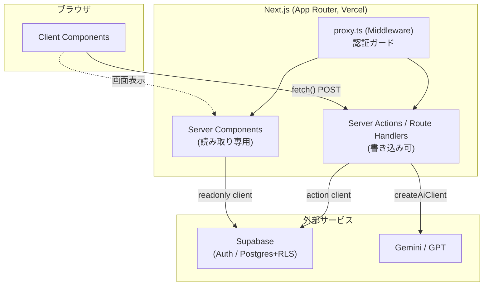
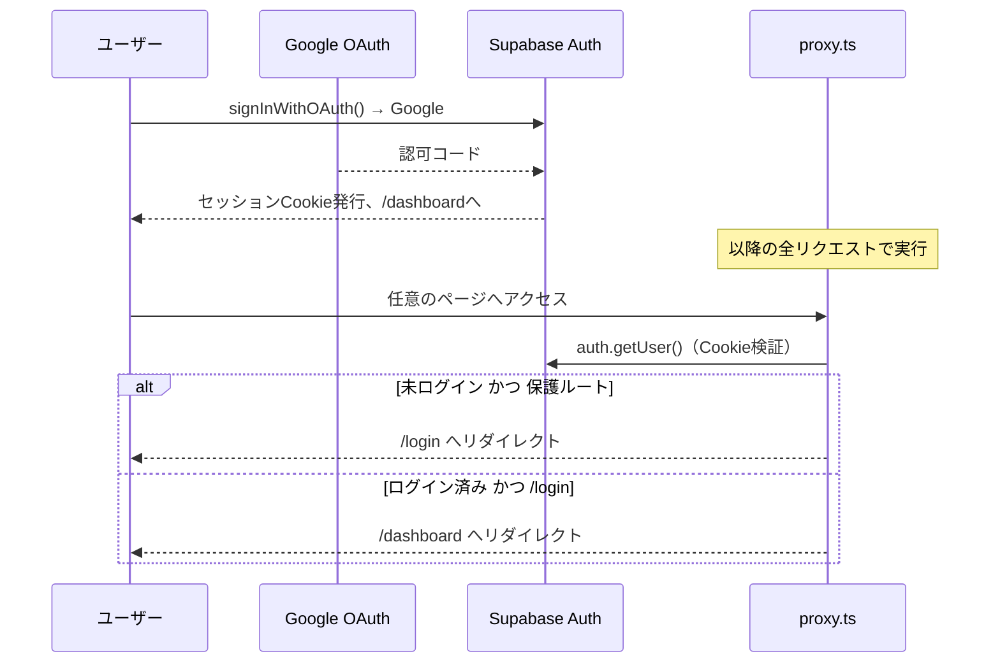

# CLAUDE.md

このファイルは、このリポジトリで作業する際にClaude Code（claude.ai/code）へ向けたガイダンスを提供する。

## プロジェクト概要

**就活copilot** は、日本の就活生向けのNext.js + Supabase製MVP。ES（エントリーシート）作成、企業管理、面接ログ、自己分析ツールを1つのダッシュボードに集約し、AIによる添削とゲーミフィケーション（XP/レベリング）を提供する。

**中核の目的**: 分断された就活タスクを1つの統合されたインターフェースに集約し、摩擦（フリクション）を取り除くこと。このアプリの価値は「もっと頑張らせること」ではなく、進捗を妨げる「フリクションタイム」を取り除くことにある。

## 技術スタック

- **フレームワーク**: Next.js 16（App Router）+ TypeScript + React 19
- **スタイリング**: Tailwind CSS v4（`bg-linear-to-*` など推奨クラスを優先）
- **バックエンド**: Supabase（Auth/Postgres/Storage、RLS有効）
- **認証**: Supabase Auth（Google OAuth）
- **AI**: プロバイダー非依存のラッパー（`lib/ai/client.ts`）— `AI_PROVIDER` 環境変数でGemini/GPTを切り替え
- **バリデーション**: Zod（DB/APIへ渡す前にすべての入力を検証）
- **アニメーション**: Framer Motion
- **ホスティング**: Vercel（無料プラン）
- **メール送信**: Nodemailer（SMTP）

すべての依存サービスは**無料プラン**で運用している（有料インフラなし）。

## 開発コマンド

```bash
npm run dev           # Next.js開発サーバーを起動 (localhost:3000)
npm run build         # 本番ビルド
npm run start         # 本番サーバーを起動
npm run lint          # ESLintを実行
npm run type-check    # TypeScriptの型チェック（変更後は必ず実行）
npm run format        # Prettierで整形
npm run format:check  # フォーマットをチェック
npm run test          # Vitestで単体テストを実行
npm run test:watch    # Vitestをwatchモードで実行
npm run test:coverage # カバレッジ計測付きでVitestを実行
npm run test:e2e      # PlaywrightでE2Eテストを実行
npm run test:e2e:ui   # PlaywrightをUIモードで実行
```

**コミット前には必ず以下を実行する**:

```bash
npm run type-check
npm run lint
npm run format:check
npm run test
```

## コアアーキテクチャ



詳細な図解（認証フロー・AI連携フロー・XPフロー・CI）は [docs/architecture.md](./docs/architecture.md) を参照。

### 認証・認可

- **Server Component**（`createSupabaseReadonlyClient`）: 読み取り専用。セッションを変更しない
- **Route Handler / Server Action**（`createSupabaseServerActionClient`）: セッションCookieを変更できる
- **認証ガード**: 未認証リクエストは `/login` へリダイレクトする。ユーザー情報は `supabase.auth.getUser()` で取得
- **RLSの徹底**: すべてのクエリはDB層で `user_id` にスコープされる。SupabaseのRLSポリシーが他ユーザーのデータへのアクセスを防ぐ



**例**:

```typescript
// Server Component（読み取り専用）
const supabase = await createSupabaseReadonlyClient();
const { data: userData } = await supabase.auth.getUser();

// Route Handler または Server Action（セッションの書き込み可）
const supabase = await createSupabaseServerActionClient();
```

### データフェッチ・状態管理

- **サーバーサイドファースト**: 可能な限りServer Componentでデータを取得し、propsとしてClient Componentへ渡す
- **並列クエリ**: 関連データの取得にはServer Component内で `Promise.all()` を使う（`app/dashboard/page.tsx` 参照）
- **外部の状態管理ライブラリは使わない**（Redux, Zustandなど）: propsとhooksのみで完結させる
- **クライアント側のミューテーション**: `fetch()` でRoute Handlerへ POST し、レスポンスを検証してUIを更新する

### AI連携

すべてのAI呼び出しは `lib/ai/client.ts` を経由する:

```typescript
const client = createAiClient();
const result = await client.call(
  input,
  "es_review" | "company_analysis" | "aptitude_analysis" | "self_analysis" | "interview_review",
);
```

**特徴**:

- プロバイダーの切り替え: `AI_PROVIDER=gemini|gpt`
- プロンプトテンプレート: `AiPromptKind` ごとにロケール別（日本語）のシステムプロンプトを持つ
- 安全なフェイルオーバー: `AI_PROVIDER_API_KEY` が未設定の場合はプレースホルダー応答を返す
- レート制限: ユーザーごとに60秒間で12リクエストまで（`/api/ai/route.ts` で強制）。永続化ストア（`api_rate_limits` テーブル、`lib/rate-limit.ts`）を使用しており、サーバーレス環境の複数インスタンス間でも一貫して機能する。コストの高い企業分析（agentic）エンドポイント `/api/ai/company/analyze` にも別枠のレート制限（10分間に5回）がある

**利用可能なプロンプト種別**:

- `es_review`: ESの構成・明瞭性・訴求力をレビューする
- `company_analysis`: 企業とのマッチ度・求める人物像を分析する
- `aptitude_analysis`: 自己診断結果から業界・職種を推薦する
- `self_analysis`: 強みとキャリアの軸を抽出する
- `interview_review`: 面接パフォーマンスへのフィードバックを行う

### データベーススキーマ・RLS

**主要テーブル**（すべてRLS有効）:

- `profiles`: ユーザープロフィール、XP、レベル、目標
- `es_entries`: Markdown・タグ・AIサマリー付きのES下書き/提出済みデータ
- `companies`: 選考ステージ・志望度・AIサマリー付きの企業カード
- `calendar_events`: 締切・面接・インターン日程を統合したカレンダー
- `xp_logs`: ゲーミフィケーションの履歴
- `interview_logs`: 面接記録＋AIサマリー
- `aptitude_results`: ユーザー1人につき1件（ユニークインデックス）、AI診断結果を保存
- `self_analysis_results`: ユーザー1人につき1件（ユニークインデックス）、AIサマリーを保存
- `webtest_questions` / `webtest_attempts`: Webテスト練習用の問題バンク（ユーザーが自ら問題を作成する自己入力方式。共有/シード済みの問題集は無い）
- `api_rate_limits`: AIエンドポイントのレート制限状態を永続化するテーブル（`lib/rate-limit.ts` が使用）

**RLSパターン**: すべてのテーブルがSELECT/INSERT/UPDATE/DELETEに対して `auth.uid() = user_id` を強制する。RLSを迂回するのは `createSupabaseAdminClient`（service roleキー）経由のクエリのみ（`/developer` ページや管理系スクリプトで限定的に使用）。

**RLSポリシーの例**:

```sql
CREATE POLICY "Enable read own es" ON es_entries
  FOR SELECT USING (auth.uid() = user_id);
```

### 入力バリデーション

**すべての入力をDB/APIへ渡す前にZodで検証する**:

- `lib/validation/schemas/forms.ts`: フォーム入力スキーマ
- `lib/validation/schemas/api.ts`: APIリクエストボディのスキーマ
- `lib/validation/schemas/ai.ts`: AIリクエストのスキーマ
- `lib/validation/schemas/contact.ts`: 問い合わせフォームのスキーマ
- `lib/validation/schemas/interviews.ts`: 面接ログのスキーマ

**パターン**:

```typescript
const schema = z.object({
  /* ... */
});
const parsed = schema.safeParse(formData);
if (!parsed.success) return { error: "Invalid input" };
// parsed.data は安全に使用できる
```

### APIルート

- `POST /api/ai`: レート制限＋認証付きでAIを呼び出す
- `POST /api/ai/company/analyze`: 企業分析（agentic、Tavily検索連携、SSEストリーミング）。専用のレート制限あり
- `GET|POST|PUT /api/calendar-events`: カレンダーイベントのCRUD
- `POST /api/contact`: 問い合わせフォームの送信（SMTP）
- `POST /api/interviews`: 面接ログの作成/更新
- `GET /api/developer/me`: 開発者判定用エンドポイント
- `POST /api/test-support/login`: **E2Eテスト専用**。`E2E_TEST_MODE` と共有シークレットの多重ガード付きで、本番以外では絶対に有効化しない（後述の「テスト」セクション参照）

すべてのRoute Handlerは以下を行う:

1. ユーザー認証を検証する
2. リクエストボディをZodで検証する
3. クエリを `user_id` にスコープする
4. JSONまたはエラーを返す

### UIパターン・スタイリング

**Tailwind v4の規約**:

- 推奨クラスを使う（`bg-linear-to-r`, `text-balance`, `text-wrap` など）
- v3の非推奨構文は警告を避けるため使わない
- テーマ: ライトモードは `<html>` に `theme-light` クラスを付与する方式（`app/globals.css` で属性セレクタによる上書きを実装。ハードコードされた色クラスに強く依存しており脆弱— Issue #116参照）

**DQ風UI**（ドラゴンクエスト風）:

- `dq-window`, `dq-title`, `dq-item`: クエストログパネル
- `dq-button`, `dq-button-secondary`: スタイル付きボタン
- `dq-menu-item`: ホバー状態を持つメニュー項目（左向き三角 `▶` がホバーで右へ移動）
- 用語: 「クエスト」「ログ」「追加へ」など

**コンポーネント構成**:

- ページレベルのレイアウト: `app/_components/layout.tsx`（`AppLayout`）
- 機能単位: `_components/` サブディレクトリにコンポーネントをコロケーションする（例: `app/dashboard/_components/`）
- 共有ユーティリティ: `lib/`（Zodスキーマ、Supabaseクライアント、AIクライアント、定数）

### ゲーミフィケーション（XPシステム）

- ユーザーはアクション（ES作成、企業追加、面接ログ記録など）でXPを獲得する
- レベル = `Math.floor(xp / 25) + 1`
- XPは `action` と任意の `ref_id` とともに `xp_logs` テーブルに記録される
- ダッシュボードに現在のXP・レベル・直近のログを表示する
- 付与ロジックは `lib/xp/award-xp.ts` を参照（重複防止・日次上限・クールダウンあり）

### よくあるページフロー

**ダッシュボード（`/dashboard`）**:

- 取得データ: ESエントリー、プロフィール、カレンダーイベント、面接ログ、XPログ
- 表示内容: サマリーカード、カレンダー、目標/軸エディタ、直近のアクティビティ
- 保護ルート: 未ログインならリダイレクト

**ES管理**（`/es`, `/es/new`, `/es/[id]`）:

- Markdownエディタで作成/編集/削除
- 質問と回答を追加
- AI添削パネル
- 保存でXP付与
- 削除時、対応するカレンダーイベントがあれば併せて削除

**企業管理**（`/companies`, `/companies/new`, `/companies/[id]`）:

- 選考ステージを追跡（未エントリー → 面接 → 内定 など）
- マイページIDを保存して追跡
- AI企業分析パネル
- 志望度/お気に入りフラグ（`favorite`カラムは存在するがUI未実装 — Issue #114参照）

**ログイン（`/login`）**:

- Supabaseログイン（Google OAuth）へリダイレクトする
- 成功すると Supabase が `/auth/callback` → `/dashboard` へリダイレクトする

### 開発ルール（AGENTS.md）

**原則**:

- **YAGNI**: 今必要なものだけ実装する。投機的な機能追加はしない
- **KISS**: 複雑な解決策よりシンプルな解決策を優先する
- **DRY**: 重複したロジックは共有のutils/componentsへ抽出する
- **型安全性**: 変更後は必ず `npm run type-check` を実行する
- **バリデーション**: ユーザー入力を信用せず、常にZodで検証する

**実装上の注意**:

- Server/Client Componentの責務境界を尊重する（関心を混在させない）
- すべてのフォーム/APIの入力をDBアクセス前に検証する
- Server Componentでは `createSupabaseReadonlyClient` を使う（Cookieを変更しない）
- Route Handlerでは `createSupabaseServerActionClient` を使う（Cookie変更可）
- AI呼び出しは必ず `lib/ai/client.ts` を経由する
- AIキー未設定時は安全に失敗する（クラッシュしない）
- コンポーネントは最大200行程度。それを超えたら分割する
- ディレクトリ構造: 種類別ではなく機能/責務別にグルーピングする

**UIの一貫性**:

- DQ-window/buttonクラスをベースにする
- メニュー項目は左向き三角のホバー効果を使う（ボックス状のボタンにしない）
- クエスト/ログ用語を使う

### テスト

**単体テスト（Vitest）**:

- テストファイルはテスト対象と同一ディレクトリにコロケーションし、`*.test.ts` サフィックスを使う
- `test/helpers/supabase-mock.ts`: Supabaseクエリビルダーの手製フェイク（`from().select().eq().maybeSingle()` 等をチェーン可能）
- `test/stubs/server-only.ts`: `server-only` パッケージ用の空スタブ（`vitest.config.ts` でエイリアス）
- 詳細な設計は `docs/testing/unit-test-plan.md` を参照

**E2Eテスト（Playwright）**:

- テストは `e2e/` ディレクトリに配置する
- 認証は「本番Supabaseに固定のテストユーザーA/Bを作成して流用」する方式。`POST /api/test-support/login` が `E2E_TEST_MODE=true` かつ `x-e2e-secret` ヘッダー一致という多重ガードの下でのみ、固定ユーザーのセッションを発行する
- `e2e/global-setup.ts` がテストユーザーの作成〜ログイン〜`storageState` 保存までを行い、`e2e/global-teardown.ts` が全テスト終了後にテストユーザーの `es_entries` を一括削除する（本番Supabase流用に伴う安全策）
- 本番Vercel環境変数には **`E2E_TEST_MODE` を絶対に設定しない**
- 詳細な設計・セキュリティ上の注意点は `docs/testing/e2e-test-plan.md` を参照

**CI（GitHub Actions）**:

- `.github/workflows/checks.yml`: 静的チェック（`checks` = lint/type-check/format:checkを1ジョブに集約）+ `build`（本番ビルド確認）
- `.github/workflows/test.yml`: `unit`（Vitest）+ `check-e2e-secrets`/`e2e`（Playwright。E2E用Secretsが未設定の間は自動スキップ）
- devブランチには必須ステータスチェック（`checks`/`build`/`unit`）を要求するルールセットが設定されている

### 環境変数

**必須**:

```env
NEXT_PUBLIC_SUPABASE_URL=...
NEXT_PUBLIC_SUPABASE_ANON_KEY=...
SUPABASE_SERVICE_ROLE_KEY=...
NEXT_PUBLIC_SITE_URL=https://job-seeker-gray.vercel.app (ローカルは localhost:3000)

# AI
AI_PROVIDER=gemini|gpt
AI_PROVIDER_API_KEY=...

# AIの追加設定（任意）
AI_MODEL=gemini-1.5-flash-latest (Geminiの場合) または gpt-4o-mini (GPTの場合)
AI_ENDPOINT=https://api.openai.com/v1/chat/completions (カスタムOpenAIエンドポイントを使う場合)
AI_API_VERSION=v1beta (Geminiの場合)

# 問い合わせフォーム（SMTP）
SMTP_HOST=smtp.gmail.com
SMTP_PORT=465
SMTP_USER=your-mail@example.com
SMTP_PASS=your-app-password
CONTACT_TO_EMAIL=contact-destination@example.com
SMTP_SECURE=true
```

**E2Eテスト用（任意。ローカルは `.env.test.local` に設定。CIはGitHub Secretsから注入）**:

```env
E2E_TEST_MODE=true
E2E_TEST_SECRET=...
E2E_TEST_USER_EMAIL=...
E2E_TEST_USER_PASSWORD=...
E2E_TEST_USER2_EMAIL=...
E2E_TEST_USER2_PASSWORD=...
```

### Supabase Auth設定

**ローカル開発**（`http://localhost:3000`）:

- Site URL: `http://localhost:3000`
- Redirect URL: `http://localhost:3000/auth/callback`, `http://localhost:3000/dashboard`

**本番**（`https://job-seeker-gray.vercel.app`）:

- Site URL: `https://job-seeker-gray.vercel.app`
- Redirect URL: `https://job-seeker-gray.vercel.app/auth/callback`, `https://job-seeker-gray.vercel.app/dashboard`

Supabaseダッシュボード → Authentication → URL Configuration で設定する。

### ページ構成

**レイアウト階層**:

- `/` — ホーム（MVP紹介、ログイン/サインアップ導線）
- `/login` — Google OAuthの入口
- `/auth/callback` — OAuthコールバックハンドラ。codeをセッションに交換する
- `/dashboard` — メインハブ（保護ルート）
- `/es`, `/es/new`, `/es/[id]` — ES管理
- `/companies`, `/companies/new`, `/companies/[id]` — 企業管理
- `/interviews`, `/interviews/new`, `/interviews/[id]` — 面接ログ
- `/self-analysis` — 自己分析アンケート＋AIサマリー
- `/aptitude` — 適性チェック＋AI診断
- `/webtests`, `/webtests/new`, `/webtests/[id]` — Webテスト練習
- `/profile` — プロフィール/目標の編集
- `/contact` — フィードバックフォーム（ログイン済みユーザー向け）
- `/developer` — 開発者向け管理ページ（`isDeveloperUserId` でゲート。ナビゲーションリンクは無く、URL直打ちでのみアクセス）

すべての保護ページ: `auth.getUser()` が失敗したら `/login` へリダイレクトする。

### 型定義

- `lib/database.types.ts`: Supabaseの型定義（Supabase CLIからの自動生成、または手動同期）
- DBの行の型: 例 `Database["public"]["Tables"]["es_entries"]["Row"]`
- クエリの型チェックと、DB変更のTypeScriptへの反映に使用する

### デプロイ

- **Vercel**（無料のHobbyプラン）でホスティング
- `dev` ブランチへのマージで自動デプロイ（GitHubのデフォルトブランチは `dev`。`master` は現在アクティブな開発フローでは使用していない — 扱いの決定はIssue #105参照）
- 環境変数はVercelダッシュボードで設定する
- ブランチごとにプレビューデプロイが作成される

### 既知のパターン・落とし穴

**避けるべきこと**:

- Server Component内で認証ロジックを書く（セッション変更にはRoute Handlerを使う）
- Supabaseクライアントの混同（Server Componentではreadonly、Route Handlerではaction client）
- ユーザー入力のZodバリデーションを省略する
- AIプロンプトを `lib/ai/client.ts` の外にハードコードする
- `user_id` スコープなしでクエリする（RLSの意図が崩れる）

**やるべきこと**:

- 編集後は必ず `npm run type-check` を実行する
- Route Handlerでのasync/awaitを正しく検証する（`supabase.auth.getUser()` を await する）
- すべてのDBクエリを `.eq("user_id", userId)` で `user_id` にスコープする
- AIキー未設定時の安全なフェイルオーバーをテストする
- 並列クエリには `Promise.all()` を使う
- 型付きのSupabase行をコンポーネントへ渡し、型安全性を保つ

## Cursor Rules

包括的なCodexガイドラインは `AGENTS.md` を参照。要点の抜粋:

- 既存のコード構造・命名規則に従う
- App Routerの基本（Server/Clientの責務）を尊重する
- 認証クエリは `user_id` にスコープする。未認証は `/login` へリダイレクトする
- すべての入力にZodバリデーションを行う
- AI呼び出しは `lib/ai/` ラッパー経由。キー未設定時は安全に失敗する
- Tailwind v4の推奨クラスを優先する（`bg-linear-to-*` など）
- DQ UIテーマ: `dq-window`, `dq-button`、三角ホバー効果のメニュー項目
- コンポーネントは200行を超えたら分割し、責務ごとにグルーピングする
