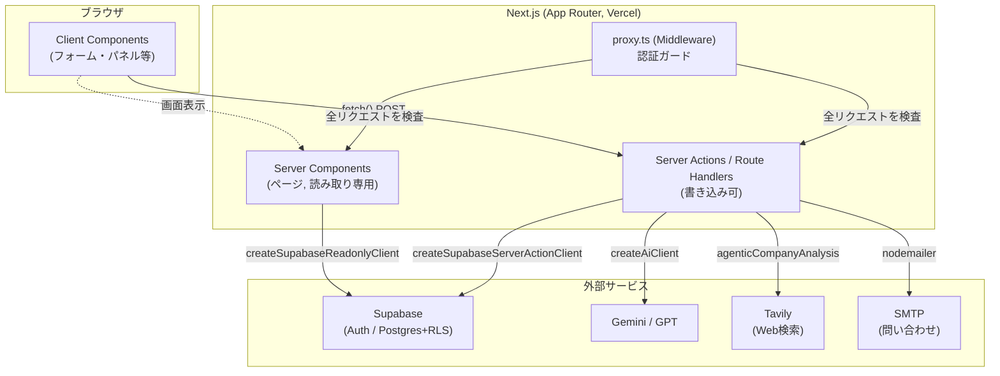
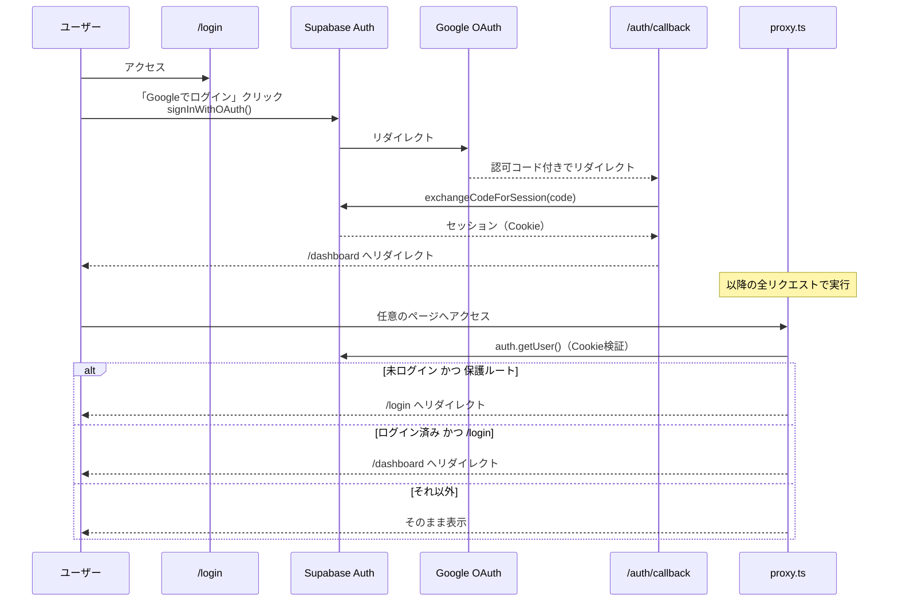
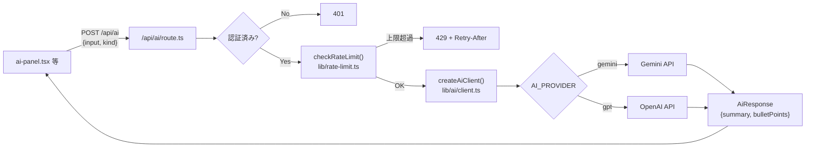
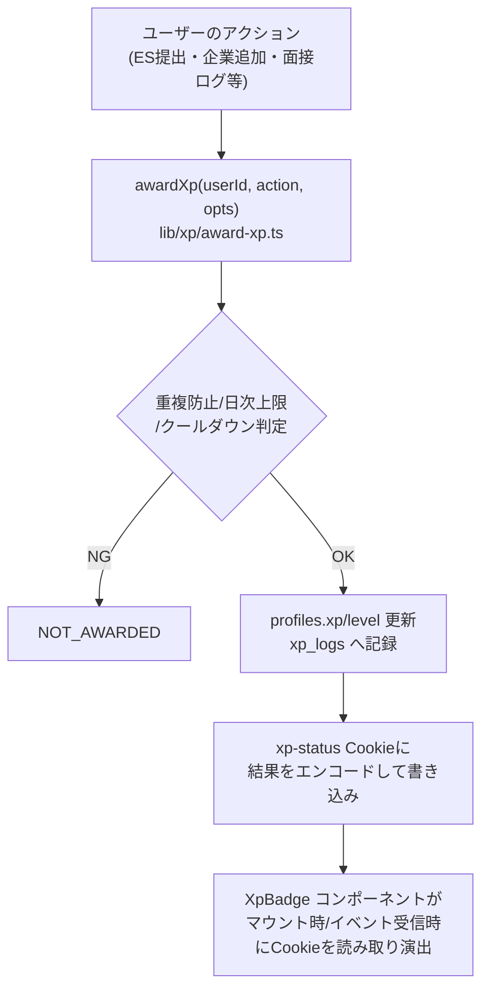
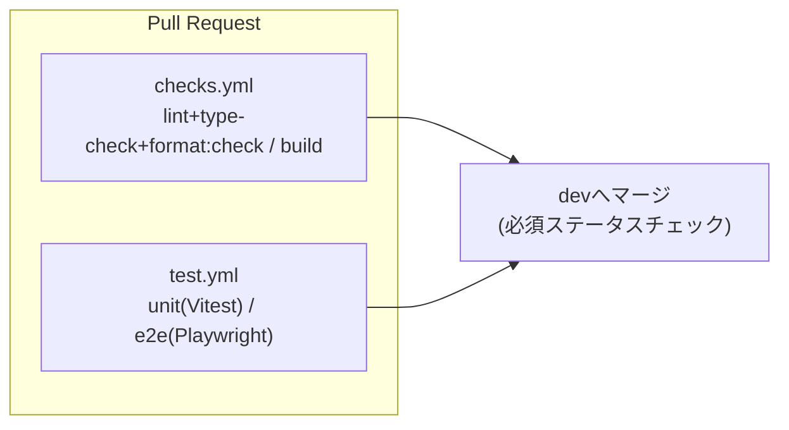

# アーキテクチャ概要

このドキュメントはコードベース全体の構造と主要フローを図解する。個別の詳細ルールは [CLAUDE.md](../CLAUDE.md) を、DBスキーマの詳細は [database-schema.md](./database-schema.md) を、テストの設計は [testing/](./testing/) を参照。

## 全体構成



- **Server Component優先**: 可能な限りサーバー側でデータ取得し、Client Componentへpropsで渡す（外部状態管理ライブラリなし）
- **`proxy.ts`**: 全リクエストで `supabase.auth.getUser()` を検証し、未ログインで保護ルートにアクセスすると `/login` へリダイレクトする（詳細後述）

## 認証フロー



公開パス（`proxy.ts` の `PUBLIC_PATHS`）: `/`, `/login`, `/auth/callback`, および `/api/*` 全体（各APIルートが個別に認証チェックを行う）。

## AI連携（プロバイダー非依存ラッパー）



- `kind`（`AiPromptKind`）ごとにロケール別（日本語）のプロンプトテンプレートを `lib/ai/client.ts` 内で保持する
- APIキー未設定時は例外を投げず、プレースホルダーの `AiResponse` を返す（安全なフェイルオーバー）
- `/api/ai/company/analyze` は上記とは別実装（`lib/ai/agentic-company.ts`）で、Tavily検索を挟みながら複数ターンLLM呼び出しを行うagenticなフロー。SSE（Server-Sent Events）で進捗をストリーミングする。こちらも独自のレート制限（10分5回）を持つ

## XP（ゲーミフィケーション）フロー



- `computeLevel(xp) = Math.floor(xp / 25) + 1`
- `redirect()` で終わるServer Actionは戻り値を返せないため、Cookie経由でフロントへXP変化を伝える一方通行の設計（`lib/xp/level-up-signal.ts`）

## テスト・CI



詳細は [testing/unit-test-plan.md](./testing/unit-test-plan.md)・[testing/e2e-test-plan.md](./testing/e2e-test-plan.md) を参照。

## ディレクトリ構成の要点

```
app/
  <feature>/            # ルートセグメント（es, companies, interviews, ...）
    _components/         # そのfeature専用のコンポーネント（コロケーション）
    actions.ts            # Server Actions
    page.tsx              # Server Component
  api/<feature>/route.ts  # Route Handlers
  _components/            # 全feature共有のコンポーネント（layout, ai-panel等）
lib/
  ai/                     # AIクライアント・設定・agentic company analysis
  supabase/               # Supabaseクライアントファクトリ（readonly/action/admin）
  validation/schemas/     # Zodスキーマ
  xp/                     # XP計算・付与ロジック
  rate-limit.ts           # 永続化レート制限
e2e/                      # Playwright E2E
docs/                     # このディレクトリ
supabase/
  schema.sql              # DBスキーマ正本
  migrations/             # 差分（schema.sqlに追記済み）
```

## 既知の技術的負債（アーキテクチャ観点）

- `app/dashboard/_components/sections/*` と `calendar/{CalendarGrid,CalendarHeader,CalendarWeekdays,CalendarModal}.tsx` は、途中で放棄されたコンポーネント分割リファクタの残骸で、どこからもimportされていない（実際は600行超のモノリス `interactive-calendar.tsx` が稼働中）。Issue #108で削除予定
- `error.tsx` / `loading.tsx` / `not-found.tsx` がリポジトリ全体に1つも無く、サーバー側の例外がNext標準のクラッシュ画面になる（Issue #109）
- ライトテーマは `globals.css` の属性セレクタによるハードコード色の力技上書きで、脆弱な構造（Issue #116、#91で本格対応予定）
