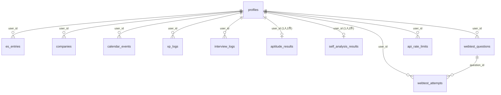

# データベーススキーマ リファレンス

- 実体: `supabase/schema.sql`（正本。Supabase SQL Editorやpsqlで実行する）
- 差分: `supabase/migrations/*.sql`（`schema.sql` に追記済みのため、新規プロジェクト構築時は `schema.sql` だけ流せば十分）
- 型定義: `lib/database.types.ts`（手動同期。テーブルを追加/変更したらこのファイルも更新すること）
- 全テーブルでRLS（Row Level Security）が有効。パターンは一貫して `auth.uid() = user_id`（`profiles` のみ `auth.uid() = id`）

## ER図（概略）

`profiles.id` は `auth.users.id` を直接参照する（Supabase Authのユーザーとプロフィールが1:1）。他の全テーブルの `user_id` も `auth.users(id)` への外部キー（`on delete cascade`）。

## テーブル一覧

### `profiles`

ユーザープロフィール・XP・レベル・目標設定。

| カラム                                         | 型        | 備考                                                                                   |
| ---------------------------------------------- | --------- | -------------------------------------------------------------------------------------- |
| `id`                                           | uuid (PK) | `auth.users.id` を参照                                                                 |
| `full_name`, `university`, `faculty`           | text      | プロフィール基本情報                                                                   |
| `avatar_id`                                    | text      | アバターID。現状 `sunrise`/`ocean` の2種類のみ実装（Issue #115でアバター拡充を検討中） |
| `target_industry`, `career_axis`, `goal_state` | text      | ダッシュボードの目標/軸エディタで編集                                                  |
| `xp`, `level`                                  | integer   | `lib/xp/award-xp.ts` が更新。`level = floor(xp / 25) + 1`                              |

### `es_entries`

ES（エントリーシート）の下書き/提出済みデータ。

| カラム                                                                | 型        | 備考                                                                                                         |
| --------------------------------------------------------------------- | --------- | ------------------------------------------------------------------------------------------------------------ |
| `company_name`, `selection_status`, `company_url`, `memo`, `deadline` | text/date | ES作成フォームの企業情報欄                                                                                   |
| `status`                                                              | text      | `'draft'`（下書き）/ `'submitted'`（提出済み）                                                               |
| `content_md`                                                          | text      | Markdown本文（質問形式を使わない場合のフォールバック）                                                       |
| `questions`                                                           | jsonb     | `{id, prompt, answer_md}[]` の配列                                                                           |
| `tags`                                                                | text[]    | 一覧のタグフィルタに使用                                                                                     |
| `score`                                                               | numeric   | **未使用**。DBに存在するがどのコードからも読み書きされていない（Issue #113でAI添削スコアとしての活用を提案） |
| `ai_summary`                                                          | text      | AI添削結果                                                                                                   |

### `companies`

企業カード。

| カラム                                     | 型      | 備考                                                                             |
| ------------------------------------------ | ------- | -------------------------------------------------------------------------------- |
| `name`, `industry`, `url`, `memo`, `stage` | text    | 一覧・詳細で表示                                                                 |
| `mypage_id`, `mypage_url`                  | text    | **未使用**。マイページ追跡用に用意されているがUI未実装（Issue #114）             |
| `preference`                               | integer | 志望度                                                                           |
| `favorite`                                 | boolean | **未使用**。お気に入りフラグを保存するカラムはあるがトグルUIが無い（Issue #114） |
| `ai_summary`                               | text    | AI企業分析結果                                                                   |

### `calendar_events`

締切・面接・インターン日程を統合したカレンダー。`type` は `'es' | 'interview' | 'intern' | 'other'` 相当（アプリ側の型定義準拠）。

### `xp_logs`

ゲーミフィケーションの履歴。`action` は `lib/xp/award-xp.ts` の `XP_CONFIG` のキー（`es_submitted`, `interview_log`, `aptitude_complete`, `self_analysis_complete`, `company_new`, `webtest_question_create`, `webtest_attempt_complete`）。`ref_id` は重複防止用の紐付け先ID。

> **注意**: `webtest_question_create` / `webtest_attempt_complete` は `XP_CONFIG` に定義されているが、`app/webtests/actions.ts` から実際には呼ばれていない（Issue #107）。

### `aptitude_results` / `self_analysis_results`

適性チェック・自己分析の結果。`user_id` にユニークインデックスがあり、**ユーザー1人につき1件しか作成できない**（一生に一度）。`answers`（jsonb）にサイズ上限は無い（Issue #112）。

### `interview_logs`

面接ログ。`questions`（jsonb）に質問/回答/評価を保存し、`self_review`・`ai_summary` を保持する。

### `webtest_questions` / `webtest_attempts`

Webテスト練習用の「問題バンク」。ただし共有・シード済みの問題集ではなく、**ユーザーが自分で問題文・答え・解説を入力し、自分で解く自己入力方式**（Issue #73でセット練習モード・AI問題生成を検討中）。`webtest_attempts.time_spent` は記録されるが、集計・分析画面は無い。

### `api_rate_limits`

AIエンドポイントのレート制限状態を永続化するテーブル（Issue #111で追加）。`(user_id, bucket)` を複合主キーとし、`bucket` ごと（例: `"ai"`, `"ai_company_analyze"`）に固定ウィンドウでカウントする。`lib/rate-limit.ts` の `checkRateLimit()` が読み書きする。

## RLSポリシーの命名規則

すべて `"Enable {read|insert|update|delete} own {テーブルの日本語的な呼び名}"` という命名で、`do $$ ... end$$` ブロック内で `if not exists` ガード付きにより冪等に適用される（同じ `schema.sql` を複数回流しても重複エラーにならない）。新しいテーブルを追加する際はこのパターンを踏襲すること。

## 既知の技術的負債

- `es_entries.score`, `companies.favorite`, `companies.mypage_id`/`mypage_url` はスキーマに存在するが未使用（上表参照）
- `lib/database.types.ts` は手動同期のため、スキーマ変更時は忘れずに更新すること
