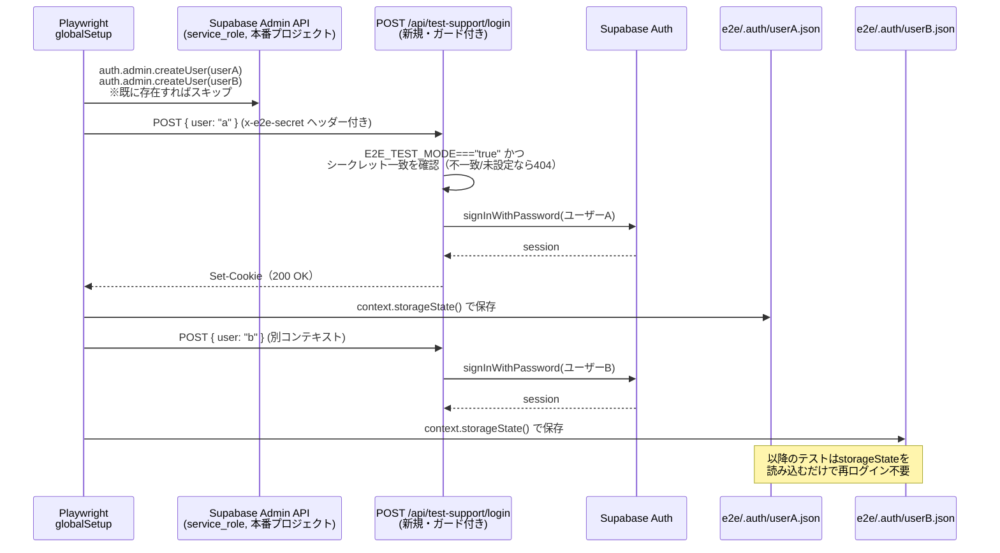
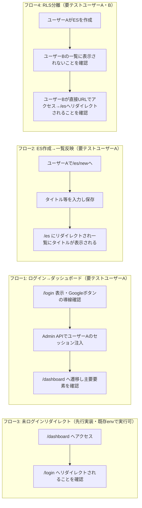

# E2Eテスト設計書（Playwright）

- 関連Issue: [#78 test: Playwright による E2E テストの導入](https://github.com/Yamada040/job-seeker/issues/78)
- 作業ブランチ: `test/issue-78-playwright-e2e`
- 対象範囲: **E2Eテストのみ**（単体テストは[#77](https://github.com/Yamada040/job-seeker/issues/77)で導入済み。設計は[docs/testing/unit-test-plan.md](./unit-test-plan.md)参照）
- 認証方式: **既存の本番Supabaseプロジェクトに、固定の専用テストユーザーを2名作成して流用**（ユーザー選定）。Supabase Admin APIでセッションを注入し、実際のGoogle OAuth画面遷移は自動化しない

## 1. 目的・対象フロー

Issue #78 に挙げられている3フローに加え、ユーザーからの指摘で**フロー4（他人のデータへのアクセス不可 = RLS分離）**を追加する。

1. ログイン（Google OAuth）→ ダッシュボード表示
2. ES作成 → 一覧に反映
3. 未ログイン状態で保護ルートにアクセス → `/login` へリダイレクト（`proxy.ts` の動作確認）
4. **（追加）ユーザーAが作成したESに、ユーザーBがアクセスできない**（`es_entries` のRLS `auth.uid() = user_id` が実際に機能していることの確認）

フロー4を成立させるには最低2人のテストユーザーが必要なため、認証設計を「テストユーザー1名」から「テストユーザー2名」に拡張する。

## 2. 前提条件（経緯とユーザー側の作業）

現状のリポジトリには **テスト用にログイン状態を作る仕組みが一切ない**（実装調査で確認済み: パスワード認証やモックログイン、ローカルSupabase環境、シードスクリプトはどれも存在しない）。`proxy.ts` は `supabase.auth.getUser()` が返す実セッションCookieのみを見て保護ルートを判定しており、`es_entries` テーブルも `auth.uid() = user_id` のRLSで保護されている。

**検討の経緯**: 当初は「E2E専用のSupabaseプロジェクトを新規作成する」案で設計したが、プロジェクト作成・スキーマ流し込み・Secrets管理のコストが見合わないとのフィードバックを受け、以下の代替案を比較した。

| 案                                                           | 内容                                                                 | 採用     |
| ------------------------------------------------------------ | -------------------------------------------------------------------- | -------- |
| (a) 専用Supabaseプロジェクトを新規作成                       | 本番と完全分離できるが、プロジェクト作成・スキーマ管理の手間が大きい | 見送り   |
| (b) Supabase CLIでローカル/CI上に使い捨て環境を起動          | 手間は少ないがDockerが前提になる                                     | 見送り   |
| (c) **既存の本番Supabaseに固定テストユーザーを作成して流用** | 新規インフラ不要。本番DBに触れるためテストデータの後片付けが必須     | **採用** |

(c) を採用したため、以下を**このリポジトリの外側（Supabaseダッシュボード or 後述のglobalSetupによる自動作成）で**準備する。

| 項目                           | 内容                                                                                                                                                                                                                                                                             |
| ------------------------------ | -------------------------------------------------------------------------------------------------------------------------------------------------------------------------------------------------------------------------------------------------------------------------------- |
| テスト用ユーザー（2名）        | 既存の本番Supabaseプロジェクト上に、それとわかる専用メールアドレス（例: `e2e-test-user-a@job-seeker.test` / `e2e-test-user-b@job-seeker.test`）でユーザーA・ユーザーBを用意する。`e2e/global-setup.ts` が `auth.admin.createUser` で冪等に自動作成するため、事前の手動作成は不要 |
| GitHub Secrets（CI用・追加分） | `E2E_TEST_MODE` / `E2E_TEST_SECRET`（test-supportルート用共有シークレット、`openssl rand -hex 32` 等で生成）/ `E2E_TEST_USER_EMAIL` / `E2E_TEST_USER_PASSWORD` / `E2E_TEST_USER2_EMAIL` / `E2E_TEST_USER2_PASSWORD`                                                              |
| GitHub Secrets（既存を再利用） | `NEXT_PUBLIC_SUPABASE_URL` / `NEXT_PUBLIC_SUPABASE_ANON_KEY` / `SUPABASE_SERVICE_ROLE_KEY` は `build` ジョブと同じものをそのまま使う（新規プロジェクトではないため別名のSecretsは不要）                                                                                          |
| ローカル用env                  | `.env.test.local`（gitignore対象、`.env*` は既にリポジトリ全体でgitignore済み）に上記を設定                                                                                                                                                                                      |

**本番データに触れる前提**であるため、以下を運用ルールとして必ず守る。

- テストユーザーのメールアドレスは一目でテスト用とわかる命名にする（本物のユーザーと誤認しないため）
- テストで作成した `es_entries` 等の行は、各テストの中で作成〜検証〜削除まで完結させる（後述のクリーンアップ参照）。テストユーザー自体のアカウント削除は必須ではないが、社内的に不要と判断した時点でAdmin APIから削除してよい
- `service_role` キーはCI Secretsとローカルの `.env.test.local` のみで扱い、コミットしない

## 3. 認証バイパスの設計

### 3.1 方式の選定理由

Google OAuthの実ログインをCIで自動化することはできない（Googleが自動化ログインをブロックするため、ToS上も不適切）。そこでSupabase Admin API (`service_role`) でテストユーザーのセッションを作り、Playwrightに注入する方式を採る。

実装方式としては、`@supabase/ssr` のCookieフォーマットを手動で再現する（reverse-engineering）のではなく、**既存の `createSupabaseServerActionClient()` をそのまま使う専用ルートを1本追加し、そのルート内で `signInWithPassword()` を呼んでCookieをNext.js側に正しく設定させる**方式にする。理由: `@supabase/ssr` のCookie形式はバージョンで変わりうる内部実装の詳細であり、手動再現は壊れやすい。既存のヘルパーを経由すれば将来のバージョンアップにも自然に追従する。

固定ユーザーを2名扱えるよう、ルートはリクエストボディで `"a"` か `"b"` のどちらのテストユーザーとしてログインするかだけを選べるようにする（メールアドレス・パスワードそのものは受け取らない＝任意アカウント乗っ取りの余地を作らない）。

### 3.2 認証バイパスのシーケンス



### 3.3 `POST /api/test-support/login`（新規追加ルート）の仕様

- パス: `app/api/test-support/login/route.ts`
- **多重ガード**（いずれか欠けても404を返す。本番環境で誤って有効化されるリスクを最小化する）:
  1. `process.env.E2E_TEST_MODE === "true"` でなければ即404
  2. リクエストヘッダー `x-e2e-secret` が `process.env.E2E_TEST_SECRET` と完全一致しなければ404
- リクエストボディ `{ "user": "a" | "b" }` でどちらの固定テストユーザーとしてログインするかだけを選べる（email/passwordそのものは受け取らない）。`"a"` は `E2E_TEST_USER_EMAIL`/`E2E_TEST_USER_PASSWORD`、`"b"` は `E2E_TEST_USER2_EMAIL`/`E2E_TEST_USER2_PASSWORD` を使う
- 内部処理: `createSupabaseServerActionClient()` → `supabase.auth.signInWithPassword({ email, password })` → 成功時は200、失敗時は500
- **`E2E_TEST_MODE` は本番のVercel環境変数に絶対に設定しない**（ローカルの `.env.test.local` とCIのe2eジョブのみ）。これはREADME/CLAUDE.mdレベルの運用ルールとして明記する

### 3.4 グローバルセットアップ（`e2e/global-setup.ts`）

1. ユーザーA・ユーザーBそれぞれについて、`auth.admin.createUser({ email, password, email_confirm: true })` で存在確認〜作成（既に存在する場合のエラーは無視 = 冪等）
2. Playwrightの `request` コンテキストを2つ用意し、それぞれ `POST /api/test-support/login` に `{ user: "a" }` / `{ user: "b" }` を送る
3. `storageState({ path: "e2e/.auth/userA.json" })` / `storageState({ path: "e2e/.auth/userB.json" })` でそれぞれ保存し、以降の認証必須テストで使い回す

### 3.5 未認証テスト（フロー3）の扱い

`e2e/.auth/*.json` を使わない専用の `test.use({ storageState: { cookies: [], origins: [] } })` で、Cookieなしの素の状態からアクセスする。

## 4. Playwrightセットアップ

### 4.1 追加する依存関係

```
@playwright/test
dotenv   # ローカル実行時に .env.test.local を読み込むため
```

### 4.2 `playwright.config.ts`（設計方針）

- `testDir: "./e2e"`
- 先頭で `dotenv.config({ path: ".env.test.local" })` を読み込む（ローカル用。CIはワークフロー側で直接envを注入するため無害）
- `globalSetup: "./e2e/global-setup.ts"` / `globalTeardown: "./e2e/global-teardown.ts"`（安全策。7節参照）
- `use.baseURL: process.env.PLAYWRIGHT_BASE_URL ?? "http://localhost:3000"`
- `webServer`: `{ command: "npm run build && npm run start", url: baseURL, reuseExistingServer: !process.env.CI }` — ビルド済みの本番相当ビルドに対してテストする（`next dev` より安定・実挙動に近い）
- `projects`: まずは `chromium` のみ（YAGNI。安定してからFirefox/WebKitを追加検討）

### 4.3 `package.json` に追加するスクリプト

```json
"test:e2e": "playwright test",
"test:e2e:ui": "playwright test --ui"
```

### 4.4 ディレクトリ構成

```
e2e/
  global-setup.ts
  global-teardown.ts        # 安全策: テストユーザーのes_entriesを丸ごと掃除
  support/
    admin-client.ts          # service_roleクライアントの共通ヘルパー
    constants.ts              # [E2E]タイトル接頭辞など
  .auth/
    userA.json              # gitignore対象（storageState、実行時生成）
    userB.json              # gitignore対象（storageState、実行時生成）
  unauthenticated-redirect.spec.ts
  login.spec.ts
  es-creation.spec.ts
  rls-isolation.spec.ts     # 追加: フロー4
```

## 5. テストシナリオ詳細



### フロー3: 未ログイン状態で保護ルートへアクセス（`e2e/unauthenticated-redirect.spec.ts`）

Supabaseへの実接続を必要としないため、既存の `.env.local` のままで先に実装・実行できる。

| ケース                               | 内容                                                                         |
| ------------------------------------ | ---------------------------------------------------------------------------- |
| ダッシュボードへの未ログインアクセス | Cookieなしの状態で `/dashboard` にアクセス → 最終URLが `/login` になっている |
| ES一覧への未ログインアクセス         | 同様に `/es` へアクセス → `/login` にリダイレクト                            |
| 公開ページはリダイレクトされない     | `/login` 自体・`/`（ホーム）は未ログインでもそのまま表示される               |

### フロー1: ログイン（Google OAuth）→ ダッシュボード表示（`e2e/login.spec.ts`）

| ケース                               | 内容                                                                                                                                |
| ------------------------------------ | ----------------------------------------------------------------------------------------------------------------------------------- |
| ログインページの導線                 | 未ログインで `/login` を開き、「Googleでログイン」ボタンが表示されていることを確認                                                  |
| Google OAuthへの遷移開始             | ボタンをクリックし、遷移先URLが `accounts.google.com` を含むことを確認したら**そこで停止**（実際のGoogleログインは自動化しない）    |
| セッション確立後のダッシュボード表示 | ユーザーAの`storageState`を使って `/dashboard` に直接アクセスし、ダッシュボードの主要要素（「現在の目標」等）が表示されることを確認 |
| ログイン済みで`/login`にアクセス     | ユーザーAの`storageState`使用時に `/login` へアクセスすると `/dashboard` にリダイレクトされる（`proxy.ts` の該当分岐を確認）        |

### フロー2: ES作成 → 一覧に反映（`e2e/es-creation.spec.ts`）

ユーザーAの`storageState` を使って認証済み状態から開始する。

| ケース             | 内容                                                                                                                       |
| ------------------ | -------------------------------------------------------------------------------------------------------------------------- |
| フォーム入力〜保存 | `/es/new` を開き、`input[name="title"]` に一意なタイトル（タイムスタンプ付き文字列）を入力し「下書きとして保存」をクリック |
| 一覧への反映       | 保存後 `/es` にリダイレクトされ、一覧内に入力したタイトルのカードが表示されることを確認（`page.getByText(title)`）         |

**後片付け（本番DBのため必須・多重化）**: タイトルには `[E2E]` 接頭辞を付け、`try`ブロックでアサーションを実行し `finally` で `service_role` クライアントから `.eq("title", title)` を確実に実行する（アサーション失敗時も削除される）。万一取りこぼした場合に備え、後述の `globalTeardown` でも二重に掃除する。

### フロー4（追加）: 他人のデータへのアクセス不可 = RLS分離（`e2e/rls-isolation.spec.ts`）

本番の `es_entries` RLSポリシー（`auth.uid() = user_id`）が実際にアプリの挙動として機能していることをE2Eで確認する。`app/es/[id]/page.tsx` は該当行が取得できない場合（存在しない/他人の行でRLSに弾かれた場合のどちらでも）`redirect(ROUTES.ES)` する実装になっている。

| ケース                      | 内容                                                                                                                       |
| --------------------------- | -------------------------------------------------------------------------------------------------------------------------- |
| 準備                        | ユーザーAのコンテキストで一意なタイトルのESを作成し、`service_role` クライアントでそのIDを取得する                         |
| 一覧に表示されない          | ユーザーBのコンテキストで `/es` を開き、ユーザーAのタイトルが**表示されない**ことを確認                                    |
| 直接URLアクセスも拒否される | ユーザーBのコンテキストで `/es/{ユーザーAのid}` に直接アクセスし、`/es` にリダイレクトされる（＝内容が見えない）ことを確認 |
| 後片付け                    | `try/finally` で `service_role` クライアントから作成した行を削除する（`globalTeardown` でも二重に掃除）                    |

### フロー共通: `globalTeardown` によるテストデータの一括掃除（安全策）

本番Supabaseを流用するリスクへの対策として、`e2e/global-teardown.ts` を追加した。全テスト終了後に（成功・失敗を問わず）必ず1回実行され、テストユーザーA・Bでそれぞれ `signInWithPassword` してユーザーIDを取得し、`service_role` クライアントで両ユーザーが所有する `es_entries` を丸ごと削除する。この2アカウントはE2E専用のため、中身を全削除しても実ユーザーへの影響は一切ない。各テストの`try/finally`によるその場クリーンアップと合わせた二重の安全策になっている。

## 6. CI組み込み

Issue #94（静的チェックの集約・テストジョブの分離）に合わせて、CIは2ワークフローに分割している。

- `.github/workflows/checks.yml`: テスト以外の静的チェック（`checks` = lint/type-check/format:checkを1ジョブに集約）と `build`
- `.github/workflows/test.yml`: テスト専用（`unit` = Vitest単体テスト、`check-e2e-secrets` + `e2e` = 今回のPlaywright）

`e2e` ジョブは `test.yml` に追加する。**新規プロジェクトではなく本番Supabaseを流用するため、Supabase接続系のSecretsは `checks.yml` の `build` ジョブと同じものをそのまま使う。** `E2E_TEST_SECRET` が未設定の間は自動でスキップし、CI全体をブロックしない。

**注意**: GitHub Actionsではジョブレベルの `if:` に `secrets` コンテキストを直接使えない（ワークフローファイル自体がパースエラーで即失敗する）。そのため `check-e2e-secrets` という前段のジョブでシークレットの有無をステップ内の環境変数として判定し、その `outputs` を `e2e` ジョブの `if:` から参照する形にしている。

```yaml
check-e2e-secrets:
  runs-on: ubuntu-latest
  outputs:
    configured: ${{ steps.check.outputs.configured }}
  steps:
    - id: check
      env:
        E2E_TEST_SECRET: ${{ secrets.E2E_TEST_SECRET }}
      run: |
        if [ -n "$E2E_TEST_SECRET" ]; then
          echo "configured=true" >> "$GITHUB_OUTPUT"
        else
          echo "configured=false" >> "$GITHUB_OUTPUT"
        fi
e2e:
  needs: check-e2e-secrets
  if: needs.check-e2e-secrets.outputs.configured == 'true'
  runs-on: ubuntu-latest
  env:
    NEXT_PUBLIC_SUPABASE_URL: ${{ secrets.NEXT_PUBLIC_SUPABASE_URL }}
    NEXT_PUBLIC_SUPABASE_ANON_KEY: ${{ secrets.NEXT_PUBLIC_SUPABASE_ANON_KEY }}
    SUPABASE_SERVICE_ROLE_KEY: ${{ secrets.SUPABASE_SERVICE_ROLE_KEY }}
    E2E_TEST_MODE: "true"
    E2E_TEST_SECRET: ${{ secrets.E2E_TEST_SECRET }}
    E2E_TEST_USER_EMAIL: ${{ secrets.E2E_TEST_USER_EMAIL }}
    E2E_TEST_USER_PASSWORD: ${{ secrets.E2E_TEST_USER_PASSWORD }}
    E2E_TEST_USER2_EMAIL: ${{ secrets.E2E_TEST_USER2_EMAIL }}
    E2E_TEST_USER2_PASSWORD: ${{ secrets.E2E_TEST_USER2_PASSWORD }}
  steps:
    - uses: actions/checkout@v4
    - uses: actions/setup-node@v4
      with:
        node-version: 20
        cache: npm
    - run: npm ci
    - run: npx playwright install --with-deps chromium
    - run: npm run test:e2e
    - uses: actions/upload-artifact@v4
      if: failure()
      with:
        name: playwright-report
        path: playwright-report/
```

## 7. セキュリティ上の注意点・本番流用のリスクと対策

本番Supabaseを流用する方針について、着手前に「本番でテストを行うことの危険性」を検討した。結論としては、**RLSにより被害範囲がテスト専用の2アカウント自身のデータに限定される**ため、他の実ユーザーには一切影響しない。残るリスクは「テスト専用アカウント内にゴミデータが残る」「service_roleキーを能動的に使う」点であり、以下の対策で軽減している。

| リスク                                                               | 対策                                                                                                                                                                    |
| -------------------------------------------------------------------- | ----------------------------------------------------------------------------------------------------------------------------------------------------------------------- |
| クリーンアップ漏れ（アサーション失敗時に削除ステップまで到達しない） | 各テストで `try/finally` により削除を保証。加えて `globalTeardown` が全テスト終了後に必ずテストユーザーA/Bの `es_entries` を丸ごと掃除する二重構成                      |
| 万一残った場合に気づけない                                           | タイトルに `[E2E]` 接頭辞を付け、Supabaseダッシュボード上で目視識別できるようにする                                                                                     |
| `service_role` キーの能動的な利用                                    | CI Secretsとローカルの `.env.test.local` のみで管理し、リポジトリにコミットしない。用途はテストユーザー作成とテストデータ削除に限定                                     |
| `E2E_TEST_MODE` の誤設定                                             | 本番のVercel環境変数に**絶対に設定しない**。`x-e2e-secret` ヘッダー一致も必須にすることで、万一誤設定されてもシークレットを知らない限りルートは機能しない（多重ガード） |
| 任意アカウントの乗っ取り                                             | `POST /api/test-support/login` は固定の2ユーザー（`"a"`/`"b"`）の選択のみ受け付け、email/passwordそのものは受け取らない                                                 |

**検討したが採用しなかった代替案**: Supabase CLIによるローカル/CI使い捨て環境（本番に一切触れないためリスク自体が消えるが、Dockerが前提になりセットアップコストが増える）。将来的に本番流用のリスクが許容できないと判断した場合はこちらへの切り替えを検討する。

## 8. スコープ外（今回は着手しない）

- Google OAuthの実ログインフローの完全自動化（技術的に不可能/非推奨）
- Firefox/WebKitでのクロスブラウザ実行（Chromiumで安定してから検討）
- 単体テスト化されていない他の全フロー（企業管理・面接ログ・Webテスト等）のE2E化
- ビジュアルリグレッション（スクリーンショット比較）

## 9. 完了の定義（DoD）

- [x] `@playwright/test` が導入され `npm run test:e2e` がCLIから実行可能
- [x] `e2e/unauthenticated-redirect.spec.ts` が実装され green（既存の `.env.local` で4件とも検証済み）
- [x] `POST /api/test-support/login` が多重ガード付きで実装されている（2ユーザー選択に対応）
- [x] `e2e/login.spec.ts` のGoogle OAuth導線テスト（遷移開始の確認のみ）が実装され green
- [x] `e2e/global-setup.ts` が実装され、必要な環境変数が無い場合は認証必須テストを自動スキップする
- [x] `e2e/global-teardown.ts`（テストデータの一括掃除の安全策）が実装され、実行してもエラーにならないことを確認済み（env未設定時は早期return）
- [x] `e2e/es-creation.spec.ts` / `e2e/rls-isolation.spec.ts` のクリーンアップが `try/finally` で保証されている
- [x] `rls-isolation.spec.ts`（フロー4: 他人のデータへのアクセス不可）が実装されている
- [ ] `e2e/global-setup.ts` が実際に2ユーザー分のセッション注入〜storageState保存まで一貫して動作する（**要: 本番SupabaseへのテストユーザーA/B用GitHub Secrets登録**）
- [ ] `e2e/login.spec.ts`（ダッシュボード表示）/ `e2e/es-creation.spec.ts` / `e2e/rls-isolation.spec.ts` が実際に実行されgreen
- [x] CIに `e2e` ジョブが追加（`E2E_TEST_SECRET` 未設定の間は自動スキップし、CI全体をブロックしない設計）
- [ ] GitHub Secretsに `E2E_TEST_MODE` 系・テストユーザーA/Bの認証情報を登録する（ユーザー側の作業）
- [ ] 本番Vercel環境変数に `E2E_TEST_MODE` が設定されていないことを確認
