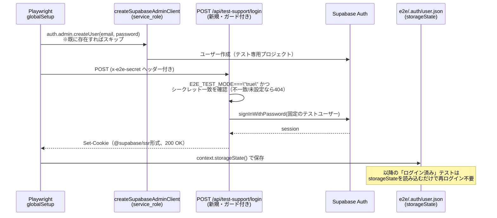
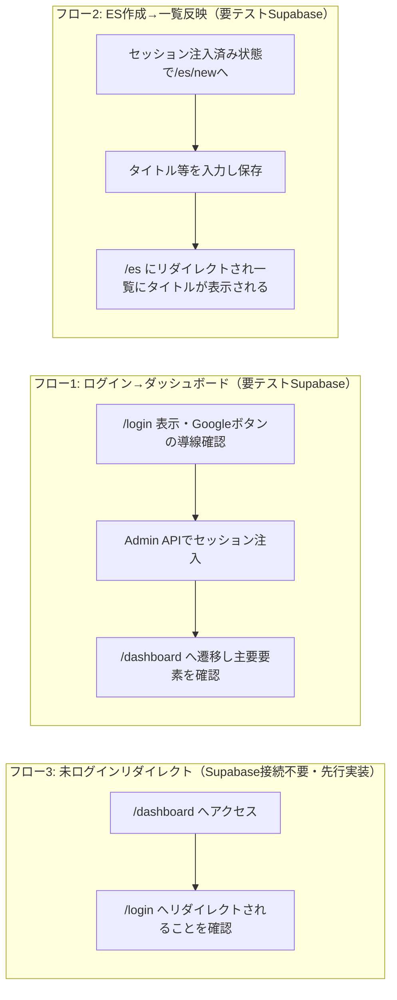

# E2Eテスト設計書（Playwright）

- 関連Issue: [#78 test: Playwright による E2E テストの導入](https://github.com/Yamada040/job-seeker/issues/78)
- 作業ブランチ: `test/issue-78-playwright-e2e`
- 対象範囲: **E2Eテストのみ**（単体テストは[#77](https://github.com/Yamada040/job-seeker/issues/77)で導入済み。設計は[docs/testing/unit-test-plan.md](./unit-test-plan.md)参照）
- 認証方式: **Supabase Admin APIによるセッション注入**（ユーザー選定）。実際のGoogle OAuth画面遷移は自動化しない

## 1. 目的・対象フロー

Issue #78 に挙げられている3フローを自動化する。

1. ログイン（Google OAuth）→ ダッシュボード表示
2. ES作成 → 一覧に反映
3. 未ログイン状態で保護ルートにアクセス → `/login` へリダイレクト（`proxy.ts` の動作確認）

## 2. 前提条件（着手前にユーザー側で用意が必要なもの）

現状のリポジトリには **テスト用にログイン状態を作る仕組みが一切ない**（実装調査で確認済み: パスワード認証やモックログイン、ローカルSupabase環境、シードスクリプトはどれも存在しない）。`proxy.ts` は `supabase.auth.getUser()` が返す実セッションCookieのみを見て保護ルートを判定しており、`es_entries` テーブルも `auth.uid() = user_id` のRLSで保護されている。

そのため以下を**このリポジトリの外側で**準備していただく必要がある。

| 項目                       | 内容                                                                                                                                                                                                                                   |
| -------------------------- | -------------------------------------------------------------------------------------------------------------------------------------------------------------------------------------------------------------------------------------- |
| 専用のSupabaseプロジェクト | 本番用とは別に、E2Eテスト専用のSupabaseプロジェクトを新規作成する。`supabase/schema.sql` と `supabase/migrations/*.sql` を流し込んでスキーマを用意する。**本番データを汚さないため必須**                                               |
| テスト用ユーザー           | 上記プロジェクト上に固定のE2Eテストユーザー（email/password）を1つ用意する（後述のグローバルセットアップで自動作成も可能）                                                                                                             |
| GitHub Secrets（CI用）     | `E2E_SUPABASE_URL` / `E2E_SUPABASE_ANON_KEY` / `E2E_SUPABASE_SERVICE_ROLE_KEY` / `E2E_TEST_USER_EMAIL` / `E2E_TEST_USER_PASSWORD` / `E2E_TEST_SECRET`（後述のtest-supportルート用の共有シークレット、`openssl rand -hex 32` 等で生成） |
| ローカル用env              | `.env.test.local`（gitignore対象）に上記と同等の値を設定                                                                                                                                                                               |

**本設計書ではこの節がクリアされるまで、認証が必要なテスト（フロー1後半・フロー2）はコードとしては実装するが、実行・グリーン化はユーザー側の環境準備後に行う。** フロー3（未ログイン→リダイレクト）はSupabaseへの実接続を必要としないため、既存の `.env.local` の値のままで先に実装・検証する。

## 3. 認証バイパスの設計

### 3.1 方式の選定理由

Google OAuthの実ログインをCIで自動化することはできない（Googleが自動化ログインをブロックするため、ToS上も不適切）。そこで以下のいずれかで代替する必要があった。

- (a) Supabase Admin API (`service_role`) でテストユーザーのセッションを作り、Playwrightに注入する
- (b) 認証が不要なフローだけに限定する

ユーザー選定により **(a)** を採用する。実装方式としては、`@supabase/ssr` のCookieフォーマットを手動で再現する（reverse-engineering）のではなく、**既存の `createSupabaseServerActionClient()` をそのまま使う専用ルートを1本追加し、そのルート内で `signInWithPassword()` を呼んでCookieをNext.js側に正しく設定させる**方式にする。理由: `@supabase/ssr` のCookie形式はバージョンで変わりうる内部実装の詳細であり、手動再現は壊れやすい。既存のヘルパーを経由すれば将来のバージョンアップにも自然に追従する。

### 3.2 認証バイパスのシーケンス



### 3.3 `POST /api/test-support/login`（新規追加ルート）の仕様

- パス: `app/api/test-support/login/route.ts`
- **多重ガード**（いずれか欠けても404を返す。本番環境で誤って有効化されるリスクを最小化する）:
  1. `process.env.E2E_TEST_MODE === "true"` でなければ即404
  2. リクエストヘッダー `x-e2e-secret` が `process.env.E2E_TEST_SECRET` と完全一致しなければ404
- 受け付けるのは固定のテストユーザーのログインのみ（リクエストボディでemail/passwordを受け取らない。`process.env.E2E_TEST_USER_EMAIL` / `E2E_TEST_USER_PASSWORD` を使う）。任意アカウントを乗っ取れる余地を作らないため
- 内部処理: `createSupabaseServerActionClient()` → `supabase.auth.signInWithPassword({ email, password })` → 成功時は200、失敗時は500
- **`E2E_TEST_MODE` は本番のVercel環境変数に絶対に設定しない**（ローカルの `.env.test.local` とCIのe2eジョブのみ）。これはREADME/CLAUDE.mdレベルの運用ルールとして明記する

### 3.4 グローバルセットアップ（`e2e/global-setup.ts`）

1. `createSupabaseAdminClient()` でテストユーザーの存在を確認し、いなければ `auth.admin.createUser({ email, password, email_confirm: true })` で作成（既に存在する場合のエラーは無視する = 冪等）
2. Playwrightの `request` コンテキストで `POST /api/test-support/login` を叩く
3. `storageState({ path: "e2e/.auth/user.json" })` でCookieを保存し、以降の認証必須テストで使い回す

### 3.5 未認証テスト（フロー3）の扱い

`e2e/.auth/user.json` を使わない専用の `test.use({ storageState: { cookies: [], origins: [] } })` で、Cookieなしの素の状態からアクセスする。

## 4. Playwrightセットアップ

### 4.1 追加する依存関係

```
@playwright/test
```

### 4.2 `playwright.config.ts`（設計方針）

- `testDir: "./e2e"`
- `globalSetup: "./e2e/global-setup.ts"`
- `use.baseURL: process.env.PLAYWRIGHT_BASE_URL ?? "http://localhost:3000"`
- `webServer`: `{ command: "npm run build && npm run start", url: baseURL, reuseExistingServer: !process.env.CI }` — ビルド済みの本番相当ビルドに対してテストする（`next dev` より安定・実挙動に近い）
- `projects`: まずは `chromium` のみ（YAGNI。安定してからFirefox/WebKitを追加検討）
- 認証必須のテストファイル（`e2e/*.authenticated.spec.ts` 等の命名規則）は `use: { storageState: "e2e/.auth/user.json" }` を指定

### 4.3 `package.json` に追加するスクリプト

```json
"test:e2e": "playwright test",
"test:e2e:ui": "playwright test --ui"
```

### 4.4 ディレクトリ構成

```
e2e/
  global-setup.ts
  .auth/user.json          # gitignore対象（storageState、実行時生成）
  unauthenticated-redirect.spec.ts
  login.spec.ts
  es-creation.spec.ts
```

## 5. テストシナリオ詳細



### フロー3: 未ログイン状態で保護ルートへアクセス（`e2e/unauthenticated-redirect.spec.ts`）

Supabaseへの実接続を必要としないため、既存の `.env.local` のままで先に実装・実行できる。

| ケース                               | 内容                                                                         |
| ------------------------------------ | ---------------------------------------------------------------------------- |
| ダッシュボードへの未ログインアクセス | Cookieなしの状態で `/dashboard` にアクセス → 最終URLが `/login` になっている |
| ES一覧への未ログインアクセス         | 同様に `/es` へアクセス → `/login` にリダイレクト                            |
| 公開ページはリダイレクトされない     | `/login` 自体・`/`（ホーム）は未ログインでもそのまま表示される               |

### フロー1: ログイン（Google OAuth）→ ダッシュボード表示（`e2e/login.spec.ts`）

| ケース                               | 内容                                                                                                                                                                     |
| ------------------------------------ | ------------------------------------------------------------------------------------------------------------------------------------------------------------------------ |
| ログインページの導線                 | 未ログインで `/login` を開き、「Googleでログイン」ボタンが表示されていることを確認                                                                                       |
| Google OAuthへの遷移開始             | ボタンをクリックし、遷移先URLが `accounts.google.com` を含むことを確認したら**そこで停止**（実際のGoogleログインは自動化しない）                                         |
| セッション確立後のダッシュボード表示 | `storageState`（Admin API経由のセッション）を使って `/dashboard` に直接アクセスし、ダッシュボードの主要要素（XPバッジ、ES/企業サマリーカードなど）が表示されることを確認 |
| ログイン済みで`/login`にアクセス     | `storageState` 使用時に `/login` へアクセスすると `/dashboard` にリダイレクトされる（`proxy.ts` の該当分岐を確認）                                                       |

### フロー2: ES作成 → 一覧に反映（`e2e/es-creation.spec.ts`）

`storageState` を使って認証済み状態から開始する。

| ケース             | 内容                                                                                                                           |
| ------------------ | ------------------------------------------------------------------------------------------------------------------------------ |
| フォーム入力〜保存 | `/es/new` を開き、`input[name="title"]` に一意なタイトル（例: タイムスタンプ付き文字列）を入力し「下書きとして保存」をクリック |
| 一覧への反映       | 保存後 `/es` にリダイレクトされ、一覧内に入力したタイトルのカードが表示されることを確認（`page.getByText(title)`）             |
| 必須バリデーション | タイトル未入力で保存しようとするとサーバー側バリデーションにより保存されない（画面上の挙動をどこまで検証するかは実装時に確定） |

**後片付け**: テストで作成した `es_entries` 行は、テスト用Supabaseプロジェクトが使い捨てである前提のため必須ではないが、繰り返し実行での一覧肥大化を避けるため、`afterEach`または`global-teardown`で `createSupabaseAdminClient()` からテストユーザーの `es_entries` を削除するクリーンアップを入れる。

## 6. CI組み込み

`.github/workflows/ci.yml` に `e2e` ジョブを追加する（既存の `lint`/`type-check`/`test`/`build` と並列）。

```yaml
e2e:
  runs-on: ubuntu-latest
  env:
    NEXT_PUBLIC_SUPABASE_URL: ${{ secrets.E2E_SUPABASE_URL }}
    NEXT_PUBLIC_SUPABASE_ANON_KEY: ${{ secrets.E2E_SUPABASE_ANON_KEY }}
    SUPABASE_SERVICE_ROLE_KEY: ${{ secrets.E2E_SUPABASE_SERVICE_ROLE_KEY }}
    E2E_TEST_MODE: "true"
    E2E_TEST_SECRET: ${{ secrets.E2E_TEST_SECRET }}
    E2E_TEST_USER_EMAIL: ${{ secrets.E2E_TEST_USER_EMAIL }}
    E2E_TEST_USER_PASSWORD: ${{ secrets.E2E_TEST_USER_PASSWORD }}
  steps:
    - uses: actions/checkout@v4
    - uses: actions/setup-node@v4
      with:
        node-version: 20
        cache: npm
    - run: npm ci
    - run: npx playwright install --with-deps chromium
    - run: npm run test:e2e
    - uses: actions/upload-artifact@v4
      if: failure()
      with:
        name: playwright-report
        path: playwright-report/
```

既存の `build` ジョブが使う本番用Secrets（`NEXT_PUBLIC_SUPABASE_URL`等）とは**別名**のSecrets（`E2E_`接頭辞）を使うことで、本番プロジェクトの資格情報とテスト用プロジェクトの資格情報を明確に分離する。

## 7. セキュリティ上の注意点

- `E2E_TEST_MODE` は本番のVercel環境変数に**絶対に設定しない**。ローカルの `.env.test.local` とCIのe2eジョブ環境のみに限定する
- `POST /api/test-support/login` は固定のテストユーザーのみログイン可能で、任意のメールアドレス/パスワードは受け付けない
- `x-e2e-secret` ヘッダー一致を必須にすることで、`E2E_TEST_MODE` が万一誤って本番に設定されても、シークレットを知らない限りルートは実質的に機能しない（多重ガード）
- テスト用Supabaseプロジェクトの `service_role` キーはCI Secretsのみで管理し、リポジトリにコミットしない

## 8. スコープ外（今回は着手しない）

- Google OAuthの実ログインフローの完全自動化（技術的に不可能/非推奨）
- Firefox/WebKitでのクロスブラウザ実行（Chromiumで安定してから検討）
- 単体テスト化されていない他の全フロー（企業管理・面接ログ・Webテスト等）のE2E化
- ビジュアルリグレッション（スクリーンショット比較）

## 9. 完了の定義（DoD）

- [x] `@playwright/test` が導入され `npm run test:e2e` がCLIから実行可能
- [x] `e2e/unauthenticated-redirect.spec.ts` が実装され green（既存の `.env.local` で4件とも検証済み）
- [x] `POST /api/test-support/login` が多重ガード付きで実装されている
- [x] `e2e/login.spec.ts` のGoogle OAuth導線テスト（遷移開始の確認のみ）が実装され green
- [x] `e2e/global-setup.ts` が実装され、必要な環境変数が無い場合は認証必須テストを自動スキップする（green時に3件skip、fail扱いにはならないことを確認済み）
- [ ] `e2e/global-setup.ts` が実際にテストユーザー作成〜セッション注入〜storageState保存まで一貫して動作する（**要: テスト用Supabaseプロジェクトのユーザー側準備**）
- [ ] `e2e/login.spec.ts`（ダッシュボード表示）/ `e2e/es-creation.spec.ts` が実際に実行されgreen（**要: テスト用Supabaseプロジェクト**）
- [x] CIに `e2e` ジョブが追加（`E2E_SUPABASE_URL` 系Secrets未設定の間は自動スキップし、CI全体をブロックしない設計）
- [ ] テスト用Supabaseプロジェクトを作成し、GitHub Secrets（`E2E_SUPABASE_URL` 等）を登録する（ユーザー側の作業）
- [ ] 本番Vercel環境変数に `E2E_TEST_MODE` が設定されていないことを確認
