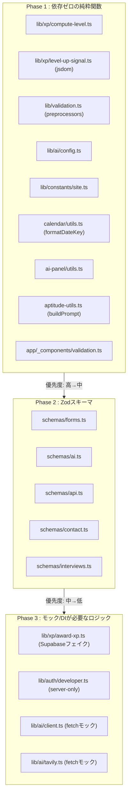
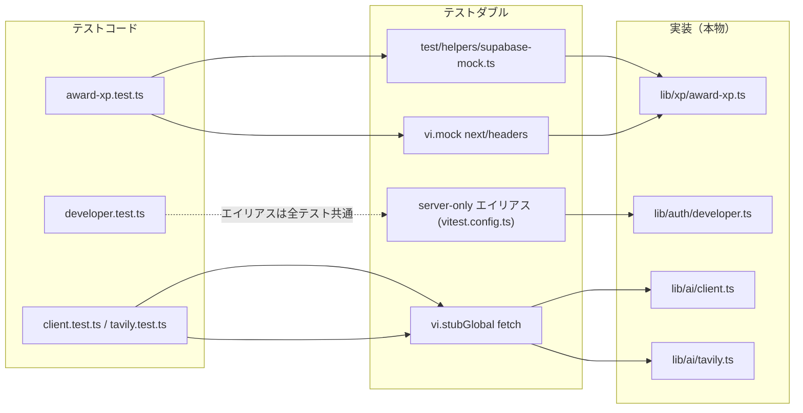
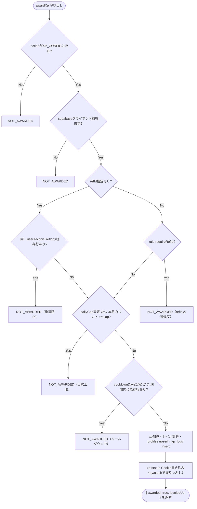

# 単体テスト設計書

- 関連Issue: [#77 test: Vitest によるユニットテストの導入](https://github.com/Yamada040/job-seeker/issues/77)
- 作業ブランチ: `test/issue-77-vitest-unit-tests`
- 対象範囲: **単体テストのみ**（結合テスト/E2Eは対象外。E2EはPlaywright導入の[#78](https://github.com/Yamada040/job-seeker/issues/78)で扱う）

## 1. 目的

現状このリポジトリにはテスト基盤が一切ない（`package.json` に `test` script なし、Jest/Vitest等の設定ファイルなし、`*.test.ts` も存在しない）。まずは **依存が少なく壊れにくいロジック層** から単体テストを整備し、リグレッションを早期検知できる状態を作る。

対象は Issue #77 に挙げられている以下の3領域を中心に、実装調査で見つかった同種の純粋ロジックまで範囲を広げる。

- `lib/validation/schemas/` 以下の Zod スキーマ
- `lib/xp/award-xp.ts` のXP付与ロジック
- `lib/xp/compute-level.ts` の `computeLevel()` 等のユーティリティ関数

## 2. テスト対象の全体像（フェーズ別）

モック不要な純粋ロジック（Phase 1）→ Zodスキーマ（Phase 2）→ モック/DIが必要なロジック（Phase 3）の順で、依存が少なく実装コストが低いものから着手する。



## 3. テストフレームワークの選定

**Vitest** を採用する。

| 観点                    | 理由                                                                                                                   |
| ----------------------- | ---------------------------------------------------------------------------------------------------------------------- |
| tsconfig との親和性     | `moduleResolution: "bundler"` / ESM 前提の本プロジェクトと相性がよく、Jest のように別途 `ts-jest`/Babel 変換設定が不要 |
| 実行速度                | Vite ベースで watch/実行が高速。ロジック層の細かいテストを多数書く前提に合う                                           |
| Next.js 16 との併用実績 | Next公式ドキュメントでもVitestが単体テストの選択肢として案内されている                                                 |
| Issue内の指定           | Issue #77 が「Vitest + @testing-library/react」を明示                                                                  |

`@testing-library/react` は Issue に記載があるが、**Phase 1〜3（今回のスコープ）ではコンポーネントテストは対象外**とし、jsdom環境の下地（`lib/xp/level-up-signal.ts` の Cookie/DOM操作テストなど）のみ先に整える。コンポーネントテストが必要になった時点で `@testing-library/react` を追加導入する。

## 4. セットアップ内容

### 4.1 追加する依存関係（devDependencies）

```
vitest
@vitejs/plugin-react       # 将来のコンポーネントテスト用に先行導入（jsxのtransformに必要）
vite-tsconfig-paths        # tsconfig の "@/*" エイリアスをVitestにも適用
jsdom                      # DOM/Cookie/windowに依存するテスト用環境
@vitest/coverage-v8        # カバレッジ計測
```

### 4.2 `vitest.config.ts`（設計方針）

- `plugins: [tsconfigPaths(), react()]` で `@/*` エイリアスとJSXを解決
- `test.environment: "node"` をデフォルトとし、DOM/Cookieに依存するテストファイルのみ先頭に `// @vitest-environment jsdom` を付与して個別に切り替える（全体を jsdom にすると Server Component 前提のコードで余計な誤動作を招きやすいため、必要な箇所だけ明示的に切り替える）
- `resolve.alias` に `"server-only": path.resolve(__dirname, "test/stubs/server-only.ts")`（中身は空export）を登録する。`lib/auth/developer.ts` が `import "server-only"` しており、これは特定のNext.jsサーバーコンテキスト外では解決できないため、テスト実行時はスタブに差し替える
- `test.setupFiles` は Phase 1 時点では不要（jsdom個別指定で足りるため）。コンポーネントテスト導入時に `@testing-library/jest-dom` 等のセットアップを追加する
- `test.coverage.provider: "v8"`、対象は `lib/**/*.ts`（`lib/database.types.ts` は除外）と `app/**/_components/**/utils.ts` 等のPhase 1で扱う純粋ロジックファイルに限定してスタート（対象を広げすぎると初期カバレッジが低く出て形骸化するため）

### 4.3 `package.json` に追加するスクリプト

```json
"test": "vitest run",
"test:watch": "vitest",
"test:coverage": "vitest run --coverage"
```

`.github/workflows/ci.yml` に `test` ジョブ（既存の `lint`/`type-check`/`build` と同じ構成で `npm run test` を実行）を追加済み。CIの静的チェック集約・テストジョブ分離の詳細検討はIssue #94で別途扱う。

### 4.4 ディレクトリ・命名規則

- テストファイルはテスト対象と **同一ディレクトリに co-locate** し、`*.test.ts` サフィックスを使う（例: `lib/xp/compute-level.ts` → `lib/xp/compute-level.test.ts`）。Next.jsのApp Router配下でも同様（`app/**/_components/**/utils.test.ts`）。理由: モノレポでのテスト探索コストを下げ、対象コード変更時にテストの存在に気づきやすくする。
- モック用の共有ヘルパーは `test/` 直下に置く（例: `test/stubs/server-only.ts`, `test/helpers/supabase-mock.ts`）

## 5. モック戦略

| 対象                          | 方法                                                                                                                                                                                                                                                    |
| ----------------------------- | ------------------------------------------------------------------------------------------------------------------------------------------------------------------------------------------------------------------------------------------------------- |
| `server-only` パッケージ      | `vitest.config.ts` の `resolve.alias` でテスト全体に対して空スタブへ差し替え                                                                                                                                                                            |
| `next/headers` の `cookies()` | `vi.mock("next/headers", () => ({ cookies: vi.fn() }))` をテストファイル内で使用。`lib/xp/award-xp.ts` が import時にこのモジュールへ依存するため、モックしないとテストファイルの読み込み自体が失敗する                                                  |
| Supabaseクライアント          | 実クライアントは使わず、`awardXp` の第三引数 `opts.supabase` にDI（依存性注入）できる作りを活用し、`from().select().eq().maybeSingle()` 等をチェーン可能な手製フェイクを `test/helpers/supabase-mock.ts` に用意する                                     |
| `fetch`（AI/Tavily呼び出し）  | `vi.stubGlobal("fetch", vi.fn())` でレスポンスをケースごとに差し替える                                                                                                                                                                                  |
| 環境変数（`process.env`）     | `lib/ai/config.ts` はモジュールトップレベルで環境変数を読み込んで定数化しているため、テストごとに値を変えるには `vi.resetModules()` + 動的 `import()` が必須。`lib/auth/developer.ts` は関数呼び出しの都度 `process.env` を読むため `resetModules` 不要 |
| 日時（`Date.now()` 依存）     | `formatDateKey` のフォールバック（不正値→現在時刻）や `award-xp` のクールダウン/日次上限判定は `vi.useFakeTimers()` + `vi.setSystemTime()` で固定する                                                                                                   |

テストダブルの適用範囲は以下の通り（Phase 3対象のみ、Phase 1/2はモック不要）。



## 6. テスト対象と具体的なテストケース

優先度順に3フェーズに分ける。**フェーズ1が今回の実装スコープの中心**（依存ゼロで最もROIが高い）。

### Phase 1: 依存ゼロの純粋関数（モック不要）

#### `lib/xp/compute-level.ts`

| ケース                            | 入力                 | 期待値                   |
| --------------------------------- | -------------------- | ------------------------ |
| レベル1の下限                     | `computeLevel(0)`    | `1`                      |
| レベル1の上限                     | `computeLevel(24)`   | `1`                      |
| レベル2への境界                   | `computeLevel(25)`   | `2`                      |
| レベル2の上限                     | `computeLevel(49)`   | `2`                      |
| レベル3への境界                   | `computeLevel(50)`   | `3`                      |
| 負のXP（クランプ）                | `computeLevel(-10)`  | `1`                      |
| 大きいXP                          | `computeLevel(1000)` | `41`                     |
| しきい値: レベル1                 | `levelThresholds(1)` | `{ prev: 0, next: 25 }`  |
| しきい値: レベル2                 | `levelThresholds(2)` | `{ prev: 25, next: 50 }` |
| しきい値: レベル0（防御的ケース） | `levelThresholds(0)` | `{ prev: 0, next: 0 }`   |

#### `lib/xp/level-up-signal.ts`（`// @vitest-environment jsdom`）

| ケース            | 内容                                                                                                                                    |
| ----------------- | --------------------------------------------------------------------------------------------------------------------------------------- |
| `encodeXpStatus`  | `{xp,level,leveledUp}` → `encodeURIComponent(JSON.stringify(...))` と一致                                                               |
| Cookieなし        | `document.cookie` に対象キーがない → `consumeXpStatusCookie()` は `null`                                                                |
| 正常なCookie      | 事前に `document.cookie` へ値をセット → パースされたオブジェクトを返し、かつ呼び出し後にCookieが削除されている（`max-age=0` で上書き）  |
| 不正なJSON        | Cookie値が壊れたJSON → `null` を返す。かつ **パース失敗時もCookieは削除されている**こと（`document.cookie`側で確認） を実装通り確認する |
| 型不一致          | `xp`/`level` が number 以外 → `null`                                                                                                    |
| `leveledUp` 欠落  | `leveledUp` を含まない値 → 戻り値の `leveledUp` が `null` になる                                                                        |
| `notifyXpUpdated` | `window.addEventListener(XP_UPDATED_EVENT, ...)` を仕込んでおき、呼び出し後にイベントが発火することを確認                               |

#### `lib/validation.ts`（プリプロセッサ）

| 関数                        | ケース                                                                                                                                      |
| --------------------------- | ------------------------------------------------------------------------------------------------------------------------------------------- |
| `requiredTrimmedString`     | 前後空白のトリム／空白のみ文字列は`min(1)`エラー／非文字列入力は型エラー                                                                    |
| `optionalTrimmedString`     | `null`/`undefined` → `undefined`／空文字・空白のみ → `undefined`（トリム後）／通常文字列はトリムして保持                                    |
| `optionalString`            | `null`/`undefined` → `undefined`／**空文字はそのまま `""` を保持**（`optionalTrimmedString` との違いを明示するテスト）                      |
| `optionalNumber`            | `""`/`null`/`undefined` → `undefined`／数値そのまま／数値文字列 `"42"` → `42`／非数値文字列 `"abc"` → `NaN` になり `.finite()` でパース失敗 |
| `optionalNonNegativeNumber` | 上記に加え、負数（`"-5"` → `-5`）は `.nonnegative()` でパース失敗                                                                           |
| `checkboxBoolean`           | `"on"` → `true`／`undefined`・`""`・`"off"` など他の値 → `false`（フィールド自体が未定義でもエラーにならず`false`になることを確認）         |

#### `lib/ai/config.ts`（`vi.resetModules()` + 動的import必須）

| ケース                               | 環境変数                     | 期待値                                                                                        |
| ------------------------------------ | ---------------------------- | --------------------------------------------------------------------------------------------- |
| デフォルトprovider                   | 未設定                       | `AI_PROVIDER === "gemini"`                                                                    |
| openaiエイリアス                     | `AI_PROVIDER=openai`         | `AI_PROVIDER === "gpt"`                                                                       |
| gpt指定                              | `AI_PROVIDER=gpt`            | `AI_PROVIDER === "gpt"`                                                                       |
| 不明な値                             | `AI_PROVIDER=foo`            | `AI_PROVIDER === "gemini"`（フォールバック）                                                  |
| APIバージョンのデフォルト/上書き     | 未設定 / `AI_API_VERSION=v1` | `"v1beta"` / `"v1"`                                                                           |
| GPTエンドポイントのデフォルト/上書き | 未設定 / `AI_ENDPOINT=...`   | デフォルトURL / 上書き値                                                                      |
| `resolvedModel` デフォルト           | `AI_MODEL`未設定             | `resolvedModel("gemini")==="gemini-1.5-flash-latest"`、`resolvedModel("gpt")==="gpt-4o-mini"` |
| `resolvedModel` 上書き               | `AI_MODEL=custom-model`      | provider問わず `"custom-model"`                                                               |
| `geminiEndpoint`                     | 任意モデル名                 | `AI_API_VERSION`・モデル名・`AI_KEY` を含むURLが組み立てられる                                |

#### `lib/constants/site.ts`（`getSiteUrl`）

| ケース                                                        | 環境変数                                                                                           | 期待値                      |
| ------------------------------------------------------------- | -------------------------------------------------------------------------------------------------- | --------------------------- |
| 全て未設定                                                    | -                                                                                                  | フォールバックURL           |
| `NEXT_PUBLIC_SITE_URL` あり（`https://`＋末尾スラッシュ複数） | `https://foo.com///`                                                                               | `https://foo.com`           |
| プロトコルなしのホスト名                                      | `NEXT_PUBLIC_SITE_URL=my-app.vercel.app`                                                           | `https://my-app.vercel.app` |
| 優先順位                                                      | `NEXT_PUBLIC_SITE_URL` と `NEXT_PUBLIC_VERCEL_URL` 両方設定                                        | 前者が優先される            |
| 優先順位2                                                     | `NEXT_PUBLIC_VERCEL_URL` と `VERCEL_PROJECT_PRODUCTION_URL` 両方設定（`NEXT_PUBLIC_SITE_URL`なし） | 前者が優先される            |

#### `app/dashboard/_components/calendar/utils.ts`（`formatDateKey`）

| ケース             | 入力                     | 期待値                                                             |
| ------------------ | ------------------------ | ------------------------------------------------------------------ |
| Dateオブジェクト   | `new Date(2026, 0, 5)`   | `"2026-01-05"`（0埋め確認）                                        |
| ISO文字列          | `"2026-12-31T00:00:00Z"` | 対応する `YYYY-MM-DD`                                              |
| タイムスタンプ数値 | `Date.now()`相当の数値   | 対応する `YYYY-MM-DD`                                              |
| 不正な文字列       | `"not-a-date"`           | 現在時刻ベースの結果（`vi.setSystemTime`で固定した現在時刻と一致） |
| `null`/`undefined` | -                        | 同上（現在時刻フォールバック）                                     |

#### `app/_components/ai-panel/utils.ts`

| 関数               | ケース                                                                                                                                                            |
| ------------------ | ----------------------------------------------------------------------------------------------------------------------------------------------------------------- |
| `sanitizeMarkdown` | `# 見出し`〜`###### 見出し`除去／`-`・`*`・`・`の箇条書きマーカーを`・`へ統一／`**太字**`のアスタリスク除去／前後トリム。複数ルールが混在する複数行入力で一括検証 |
| `buildCopyText`    | `summary`のみ／`bulletPoints`のみ／両方あり／空の`response`（`{}`）→ `""`                                                                                         |

#### `app/aptitude/_components/aptitude-utils.ts`（`buildPrompt`）

| ケース                    | 内容                                          |
| ------------------------- | --------------------------------------------- |
| 全項目入力済み            | 期待される12行の文字列と完全一致              |
| 配列項目が空配列          | `interests`/`strengths`/`values` → `"未選択"` |
| 文字列項目が空文字/未定義 | 各項目 → `"未記入"`                           |

#### `app/_components/validation.ts`

| 関数       | ケース                                                     |
| ---------- | ---------------------------------------------------------- |
| `tooLong`  | デフォルト`max=100`／`max`を明示指定した場合の文言差し替え |
| `required` | ラベル文言の埋め込み確認                                   |

### Phase 2: Zodスキーマ（`lib/validation/schemas/*`）

各スキーマについて **正常系1〜2ケース＋境界値／異常系** を用意する。

| ファイル        | スキーマ                                            | 主なテストケース                                                                                             |
| --------------- | --------------------------------------------------- | ------------------------------------------------------------------------------------------------------------ |
| `forms.ts`      | `profileFormSchema`                                 | `full_name`のみで成立／`full_name`欠落でエラー／`full_name`が空白のみでエラー（トリム後min1）                |
| `forms.ts`      | `dashboardEsEntrySchema` / `dashboardCompanySchema` | 省略時のデフォルト値（`status:"下書き"`, `content_md:""`, `url:""`, `stage:"未エントリー"`）が適用されること |
| `forms.ts`      | `companyFormSchema`                                 | `preference`が数値文字列→数値変換／空文字→`undefined`／`favorite`が`"on"`→`true`、省略→`false`               |
| `forms.ts`      | `esQuestionSchema` / `esQuestionsSchema`            | 空配列許容／部分的なフィールドのみのオブジェクト許容                                                         |
| `forms.ts`      | `esFormSchema`                                      | `content_md`/`tags`/`intent`のデフォルト値／`title`必須                                                      |
| `forms.ts`      | `webtestQuestionFormSchema`                         | `title`/`body`/`answer`必須（空白のみで失敗）／`time_limit`が負の文字列でエラー                              |
| `forms.ts`      | `webtestAnswerFormSchema`                           | `answer`省略時`""`／`time_spent`が`""`で`undefined`扱い                                                      |
| `ai.ts`         | `aiRequestSchema`                                   | `input`8000文字ちょうどはOK、8001文字でエラー／トリム後空文字でエラー／`kind`が不正なenum値でエラー          |
| `ai.ts`         | `idAndSummarySchema`                                | 必須文字列の欠落でエラー                                                                                     |
| `api.ts`        | `answersPayloadSchema`                              | 任意キー・任意値のレコードを許容                                                                             |
| `api.ts`        | `calendarEventSchema`                               | `date`/`title`必須／`company`等が`null`許容                                                                  |
| `contact.ts`    | `contactRequestSchema`                              | `subject`120文字境界／`message`2000文字境界／日本語エラーメッセージが期待通り返る                            |
| `interviews.ts` | `interviewRequestSchema`                            | `questions`が配列直接指定／`{items, reflection}`形式のどちらも許容（union）／`rating`に不正な値でエラー      |

### Phase 3: モック/DIが必要なロジック

#### `lib/xp/award-xp.ts`（Supabaseフェイククライアントを注入）

`awardXp` の判定フローは以下の通り。各分岐がそのままテストケースに対応する。



| ケース                         | 内容                                                                                                             |
| ------------------------------ | ---------------------------------------------------------------------------------------------------------------- |
| 未定義のaction                 | `XP_CONFIG`にないaction文字列 → `{awarded:false, leveledUp:null}`、Supabase呼び出しなし                          |
| `requireRefId`必須違反         | `refId`省略時 → `NOT_AWARDED`（`es_submitted`, `interview_log`, `company_new`, `webtest_question_create`で確認） |
| 重複防止                       | 同一`user_id`+`action`+`ref_id`の既存行がある → `NOT_AWARDED`                                                    |
| 日次上限                       | `dailyCap`到達（`count >= dailyCap`） → `NOT_AWARDED`（`company_new`のcap=5などで確認）                          |
| クールダウン                   | `cooldownDays`以内に既存行あり → `NOT_AWARDED`（`aptitude_complete`のcap=30日で確認）                            |
| 正常付与                       | 条件を満たす呼び出し → `awarded:true`、`profiles.upsert`と`xp_logs.insert`が期待した引数で呼ばれる               |
| レベルアップ境界               | `currentXp=24`, `amount=25`（es_submitted） → `nextXp=49`, `leveledUp=2`                                         |
| レベルアップなし               | `currentXp=0`, `amount=5`（company_new） → `leveledUp=null`                                                      |
| Cookie書き込み失敗の握りつぶし | `cookies()`のモックが例外を投げても`awarded:true`が返る（try/catchの動作確認）                                   |

テスト用の共有フェイク: `test/helpers/supabase-mock.ts` に `from(table).select().eq().eq().eq().maybeSingle()` 等をチェーンできる最小限のビルダーを実装し、各テストでテーブルごとの戻り値を差し替え可能にする。

#### `lib/auth/developer.ts`（`server-only`エイリアス経由）

| ケース                            | 内容                                                   |
| --------------------------------- | ------------------------------------------------------ |
| `userId`が`null`/`undefined`/`""` | 常に`false`                                            |
| `DEV_ADMIN_USER_IDS`未設定        | 任意IDで`false`                                        |
| 前後空白・カンマ区切り            | `"id1, id2 ,id3"` → `isDeveloperUserId("id2")`が`true` |
| 空要素の除去                      | `"id1,,id2"` → 空文字は無視され、`id1`/`id2`のみ有効   |

#### `lib/ai/client.ts` / `lib/ai/tavily.ts`（`fetch`モック）

| ケース                          | 内容                                                                                                               |
| ------------------------------- | ------------------------------------------------------------------------------------------------------------------ |
| APIキー未設定（gemini/gpt双方） | `fetch`を呼ばず`missingKeyResponse()`相当を返す                                                                    |
| Gemini成功系                    | `candidates[0].content.parts[].text`から`summary`結合、`-`/`・`始まりの行を`bulletPoints`として抽出                |
| Gemini非okレスポンス            | 例外を投げず、日本語の汎用エラーメッセージを返す                                                                   |
| GPT成功系/非ok系                | Gemini同様のパターンをOpenAI形式のレスポンスで検証                                                                 |
| provider切り替え                | `createAiClient()`が`AI_PROVIDER=gpt`のときOpenAIエンドポイントへ、それ以外はGeminiエンドポイントへ`fetch`すること |
| `tavilySearch`：キー未設定      | `fetch`を呼ばず`{query, results: []}`を即返す                                                                      |
| `tavilySearch`：非okレスポンス  | `Error`をthrowする                                                                                                 |

補足: `templates`（プロンプト文字列生成）は現状 `lib/ai/client.ts` 内非公開のため、直接テストするには `export` を追加するか、`fetch`モックのリクエストボディを検査して間接的に確認する。優先度は低いため今回は後者（間接検証）で対応し、必要であれば別issueでリファクタリングを提案する。

## 7. スコープ外（今回は着手しない）

- コンポーネントテスト（`@testing-library/react`導入含む）
- `app/es/actions.ts` の `parseQuestions`/`combineContent` など、現状exportされていないServer Action内部ロジックのユニットテスト化（テストのために`export`を追加するリファクタが必要なため、実施する場合は別途スコープを切る）
- `app/api/ai/route.ts` のレートリミッター（`checkAiRateLimit`がモジュール非公開かつ`Date.now()`依存のシングルトン`Map`であるため、`lib/`への切り出しリファクタが前提。別issue化を推奨）
- E2E（Playwright, Issue #78）

## 8. 完了の定義（DoD）

- [x] Vitest一式が導入され `npm run test` がCLIから実行可能
- [x] Phase 1（依存ゼロの純粋関数）のテストが全て実装され green（9ファイル）
- [x] Phase 2（Zodスキーマ）のテストが全て実装され green（5ファイル）
- [x] Phase 3（DIモックが必要なロジック）のテストが全て実装され green（4ファイル）
- [x] `npm run type-check` / `npm run lint` / `npm run format:check`（変更ファイル）が通る
- [x] CI（`.github/workflows/ci.yml`）に `test` ジョブを追加
- [x] 本設計書のPhase 1〜3が実装内容と乖離していないこと（乖離があれば本ドキュメントを更新する）
